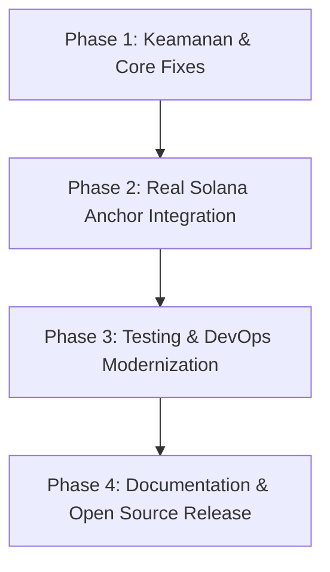

# Audit Deficiencies & Publish Readiness Roadmap (VeriLog Audit Engine)

Dokumen ini merekap hasil audit komprehensif terhadap seluruh modul dalam workspace **VeriLog-Audit-Engine** (`shared`, `agent`, `verifier`, `simulator`, `tamper`, `programs/verilog_audit`, `dashboard`, `tests`, `.github`, dan `Dockerfile`).

Tujuan audit ini adalah mengidentifikasi **seluruh celah (deficiencies), bug, keterbatasan arsitektur, celah keamanan, testing gap, dan kekurangan DevOps** yang harus diperbaiki agar proyek ini **layak dipublikasikan (publish-ready / production-ready)** untuk open-source maupun enterprise adoption.

---

## 📊 Summary & Scorecard Kelayakan Publish

| Kategori Audit | Status Saat Ini | Skor Ready | Prioritas |
| :--- | :--- | :---: | :---: |
| **1. Kriptografi & Keamanan Core** | Memiliki Merkle Tree Keccak256, namun belum ada Digital Signature & HMAC Auth | **55%** | 🔴 HIGH |
| **2. Stabilitas & Robustness Codebase** | Masih banyak `.unwrap()` di main thread/worker, belum ada Exponential Backoff Retry | **60%** | 🔴 HIGH |
| **3. Integrasi Blockchain & Solana Anchor** | Program Anchor dasar ada, namun RPC sender masih mock & PDA space hardcoded | **50%** | 🔴 HIGH |
| **4. Testing, Benchmark & QA Coverage** | Hanya 1 unit test sederhana (`shared_integration.rs`), tidak ada integration/load test | **30%** | 🔴 HIGH |
| **5. Infrastructure, Docker & CI/CD** | Dockerfile menggunakan image EOL (`buster-slim`), CI deprecate `actions-rs` | **45%** | 🟡 MEDIUM |
| **6. Dokumentasi & Standardization** | Lisensi di README ambigu (`MIT / Apache 2.0 (Please specify)`), belum ada OpenAPI spec | **65%** | 🟡 MEDIUM |

---

## 🔍 Detail Defisiensi per Kategori & Rekomendasi Perbaikan

### 1. Kriptografi & Keamanan Core (Security & Cryptography)

#### ❌ Defisiensi 1.1: Tidak Ada Non-Repudiation (Digital Signatures)
* **Temuan**: Log entry diserap oleh `agent` dan di-hash menggunakan Keccak256, namun log tersebut **tidak ditandatangani secara digital** (`Ed25519` keypair) oleh pengirim/service asal.
* **Resiko**: Pihak dengan akses database internal SQLite dapat membuat log palsu baru yang tampak valid selama format hash-nya disesuaikan sebelum Merkle root dibentuk.
* **Rekomendasi Fix**: Tambahkan field `signature` dan `public_key` pada `AuditLog` di [shared/src/lib.rs](file:///Users/mac/untitled%20folder/VeriLog-Audit-Engine/shared/src/lib.rs#L50-L60). Validasi signature sebelum log dimasukkan ke buffer batching.

#### ❌ Defisiensi 1.2: Inkomplit Canonicalization Hash Data Model
* **Temuan**: Metode `compute_hash` di [shared/src/lib.rs](file:///Users/mac/untitled%20folder/VeriLog-Audit-Engine/shared/src/lib.rs#L63-L67) hanya memformat 4 field: `service|user_id|amount|timestamp`. Field penting seperti `event_type` dan `actor_id` diabaikan dalam penghitungan hash.
* **Resiko**: Jika penyerang mengubah `event_type` (misal dari `TRANSFER` ke `READ`) atau `actor_id`, `compute_hash()` **tidak akan mendeteksi perubahan tersebut** karena field tersebut tidak masuk ke string payload hashing!
* **Rekomendasi Fix**: Sertakan seluruh field deterministik (`service|user_id|amount|timestamp|event_type|actor_id`) ke dalam canonical string hashing.

#### ❌ Defisiensi 1.3: Pengiriman Log Tanpa Autentikasi / Rate Limiting
* **Temuan**: Endpoint `/api/collect` di [agent/src/main.rs](file:///Users/mac/untitled%20folder/VeriLog-Audit-Engine/agent/src/main.rs#L333-L340) dapat diakses secara publik tanpa HTTP API Key / HMAC Header / Rate Limiting.
* **Resiko**: Denial of Service (DoS) dan spam log palsu dari client tidak terautentikasi.
* **Rekomendasi Fix**: Tambahkan middleware Axum untuk validasi `X-API-Key` atau Signature Header + `tower-governor` untuk rate limiting.

---

### 2. Stabilitas Codebase & Runtime Robustness

#### ❌ Defisiensi 2.1: Penggunaan `.unwrap()` & `.expect()` di Production Path
* **Temuan**: Di [agent/src/main.rs](file:///Users/mac/untitled%20folder/VeriLog-Audit-Engine/agent/src/main.rs#L107-L125), [verifier/src/main.rs](file:///Users/mac/untitled%20folder/VeriLog-Audit-Engine/verifier/src/main.rs#L9-L38), dan [tamper/src/main.rs](file:///Users/mac/untitled%20folder/VeriLog-Audit-Engine/tamper/src/main.rs#L9-L31), terdapat puluhan pemanggilan `.unwrap()` pada query SQLite dan r2d2 pool access.
* **Resiko**: Jika database locked sementara (misal saat WAL checkpoint) atau query gagal, thread worker atau server Axum akan **panic/crash**.
* **Rekomendasi Fix**: Ganti seluruh `.unwrap()` dengan proper Rust error handling (`Result<T, E>`, `?` operator, dan error response JSON yang proper).

#### ❌ Defisiensi 2.2: Potensi Log Loss pada High Load (`try_send`)
* **Temuan**: Di [agent/src/main.rs](file:///Users/mac/untitled%20folder/VeriLog-Audit-Engine/agent/src/main.rs#L335), `collect_log` menggunakan `state.log_tx.try_send(payload)`. Jika buffer channel (10,000) penuh, endpoint mengembalikan error `QUEUE_FULL` dan log **dibuang (dropped)**.
* **Resiko**: Kehilangan log audit berharga saat traffic spike.
* **Rekomendasi Fix**: Implementasikan asynchronous backpressure atau staging ring buffer / local disk persistence (misal sled / RocksDB WAL) sebelum dimasukkan ke batcher queue.

#### ❌ Defisiensi 2.3: Incomplete Exponential Backoff Retry System
* **Temuan**: [agent/src/retry.rs](file:///Users/mac/untitled%20folder/VeriLog-Audit-Engine/agent/src/retry.rs) telah mendefinisikan struct `RpcJob`, namun di [agent/src/main.rs](file:///Users/mac/untitled%20folder/VeriLog-Audit-Engine/agent/src/main.rs#L73-L103) worker RPC langsung menandai batch sebagai `FAILED` tanpa mekanisme retry bertingkat (exponential backoff).
* **Resiko**: Kegagalan jaringan sekejap ke RPC Solana akan membuat batch tertahan permanen pada status `FAILED`.
* **Rekomendasi Fix**: Implementasikan loop retry dengan delay eksponensial (misal 1s, 2s, 4s, 8s) dan simpan failed jobs di SQLite table `failed_batches` untuk background recovery.

#### ❌ Defisiensi 2.4: Pagination Total Metadata Hardcoded `0`
* **Temuan**: Di [agent/src/main.rs](file:///Users/mac/untitled%20folder/VeriLog-Audit-Engine/agent/src/main.rs#L252), response `/api/logs` mengembalikan `"total": 0`.
* **Resiko**: Frontend Dashboard tidak dapat menghitung total halaman log dengan benar.
* **Rekomendasi Fix**: Jalankan `SELECT COUNT(*) FROM audit_logs` atau peroleh estimate total count untuk disajikan di `meta.total`.

---

### 3. Integrasi Blockchain & Solana Anchor Program

#### ❌ Defisiensi 3.1: Sender RPC Solana Masih Bersifat Mock
* **Temuan**: [agent/src/sender.rs](file:///Users/mac/untitled%20folder/VeriLog-Audit-Engine/agent/src/sender.rs#L16-L21) memiliki `MOCK_SOLANA` default `"true"`. Selain itu, kode pengiriman Anchor transaction sebenarnya di comment / disederhanakan sebagai HTTP check ke RPC URL.
* **Resiko**: Sistem belum benar-benar melakukan interaksi transaksi Anchor (invoke instruction `record_audit_log`) ke cluster Devnet/Mainnet Solana.
* **Rekomendasi Fix**: Implementasikan pemanggilan Anchor RPC instruction asli menggunakan `anchor-client` dengan keypair terdaftar dan rpc client signature submission.

#### ❌ Defisiensi 3.2: Hardcoded Keypair & Program ID Solana
* **Temuan**: `Keypair::new()` di [agent/src/sender.rs](file:///Users/mac/untitled%20folder/VeriLog-Audit-Engine/agent/src/sender.rs#L26) membuat keypair baru di setiap request RPC sender. Program ID di-hardcode ke dummy key (`VeriLog11111...`).
* **Resiko**: Keypair baru tidak memiliki SOL untuk membayar gas fee (rent exemption & transaction fee), sehingga transaksi pasti akan gagal di network asli.
* **Rekomendasi Fix**: Muat keypair pembayar dari file wallet (`SOLANA_KEYPAIR_PATH` atau environment variable `SOLANA_PAYER_KEYPAIR_JSON`).

#### ❌ Defisiensi 3.3: Space Allocation Fixed pada Anchor Program
* **Temuan**: Pada Anchor program [programs/verilog_audit/src/lib.rs](file:///Users/mac/untitled%20folder/VeriLog-Audit-Engine/programs/verilog_audit/src/lib.rs#L36), space dialokasikan manual: `space = 8 + 32 + 8 + 50 + 50 + 32`.
* **Resiko**: Jika `service_id` atau `batch_id` yang dikirim lebih panjang dari alokasi 50 bytes, transaksi Solana akan panic dengan error `AccountDataTooSmall`.
* **Rekomendasi Fix**: Gunakan derive macro `#[derive(InitSpace)]` dari Anchor 0.29+ agar perhitungan space account PDA dihitung secara otomatis dan aman.

#### ❌ Defisiensi 3.4: Verifier Belum Melakukan On-Chain Cross-Verification
* **Temuan**: Package [verifier/src/main.rs](file:///Users/mac/untitled%20folder/VeriLog-Audit-Engine/verifier/src/main.rs) hanya membandingkan Merkle root lokal SQLite dengan recomputed root dari log SQLite.
* **Resiko**: Jika penyerang mengubah **KEDUA** tabel SQLite (`audit_logs` dan `batches`), `verifier` lokal akan melaporkan data valid padahal sudah berbeda dengan yang tercatat di Solana on-chain.
* **Rekomendasi Fix**: `verifier` harus menarik account data PDA dari RPC Solana, membaca `merkle_root` on-chain, lalu menguji korelasi **Off-Chain SQLite vs On-Chain Solana State**.

---

### 4. Testing, Benchmark & Quality Assurance

#### ❌ Defisiensi 4.1: Minimal Test Coverage (< 15%)
* **Temuan**: Hanya ada 1 test file [tests/shared_integration.rs](file:///Users/mac/untitled%20folder/VeriLog-Audit-Engine/tests/shared_integration.rs) dengan 1 test case. Tidak ada unit test untuk `agent`, `verifier`, `db`, maupun handler Axum.
* **Rekomendasi Fix**: Tambahkan:
  * Unit test untuk SQLite DB queries & transaction rollback (`shared/src/db.rs`).
  * End-to-end integration test untuk Axum API routes menggunakan `tower::ServiceExt` (`agent/src/main.rs`).
  * Test skenario tampering & verification response.

#### ❌ Defisiensi 4.2: Tidak Ada Benchmark Ingestion & Hashing Performance
* **Temuan**: Tidak ada suite benchmark untuk mengukur throughput log ingestion (log/detik) dan waktu generasi Merkle root saat jumlah log mencapai 10.000+ per batch.
* **Rekomendasi Fix**: Tambahkan benchmark crate `criterion` di workspace `benches/merkle_bench.rs`.

---

### 5. Infrastructure, Docker & DevOps

#### ❌ Defisiensi 5.1: Dockerfile Outdated & Inkomplit
* **Temuan**: [Dockerfile](file:///Users/mac/untitled%20folder/VeriLog-Audit-Engine/Dockerfile) menggunakan base image `rust:1.70` dan runtime `debian:buster-slim` (Buster sudah End-of-Life / EOL). Dockerfile juga **tidak menyalin folder `dashboard`** ke container final.
* **Resiko**: Endpoint Axum `.nest_service("/", ServeDir::new(&dashboard_path))` akan 404 saat dijalankan di dalam Docker container karena folder `dashboard` tidak ikut ter-copy.
* **Rekomendasi Fix**: Update Dockerfile ke `rust:1.78-bookworm` & `debian:bookworm-slim`, tambahkan `COPY --from=builder /usr/src/verilog/dashboard ./dashboard`, dan jalankan container dengan non-root user.

#### 5.2: CI Workflow Deprecated & Inkomplit
* **Temuan**: [.github/workflows/ci.yml](file:///Users/mac/untitled%20folder/VeriLog-Audit-Engine/.github/workflows/ci.yml#L26) menggunakan `actions-rs/toolchain@v1` yang sudah unmaintained/deprecated oleh komunitas GitHub. CI juga belum menyertakan `cargo-audit` (vulnerability check) dan security scan.
* **Rekomendasi Fix**: Gunakan `dtolnay/rust-toolchain@stable` dan tambahkan job `cargo audit`.

#### ❌ Defisiensi 5.3: Tidak Ada `docker-compose.yml`
* **Temuan**: Pengembang harus menjalankan agent, simulator, dan validator Solana secara manual dengan banyak terminal.
* **Rekomendasi Fix**: Sediakan `docker-compose.yml` yang mengorkestrasi `solana-test-validator`, `agent`, `simulator`, dan `verifier`.

---

### 6. Dokumentasi & Standardization Open Source

#### ❌ Defisiensi 6.1: Ambiguasi Lisensi
* **Temuan**: [README.md](file:///Users/mac/untitled%20folder/VeriLog-Audit-Engine/README.md#L210) menuliskan `MIT / Apache 2.0 (Please specify)`. Di root folder terdapat file `LICENSE` (MIT).
* **Rekomendasi Fix**: Tentukan secara eksplisit di README.md bahwa proyek ini berlisensi MIT / Apache-2.0 Dual License.

#### ❌ Defisiensi 6.2: Belum Ada File OpenAPI / Swagger Spec
* **Temuan**: REST API agent (`/api/collect`, `/api/logs`, `/api/batches`, dll) belum terdokumentasi dengan standar OpenAPI (Swagger).
* **Rekomendasi Fix**: Tambahkan `utoipa` / `utoipa-swagger-ui` di Axum agent atau sediakan `openapi.yaml`.

---

## 🎯 Plan Action: Langkah-Langkah Menuju "Layak Publish"

### 📋 Check-list Prioritas Eksekusi

#### Phase 1: Keamanan Data & Refactoring Core (Estimasi: 1-2 Hari)
- [ ] Implementasikan field `signature` & `public_key` pada `AuditLog` di `shared`.
- [ ] Perbaiki `compute_hash` agar mencakup `event_type` dan `actor_id`.
- [ ] Ganti seluruh `.unwrap()` pada database query dengan error handling proper.
- [ ] Tambahkan API Key Auth middleware di Axum agent.

#### Phase 2: Interaksi Solana Anchor On-Chain & Verifier Cross-Check (Estimasi: 2 Hari)
- [ ] Update `programs/verilog_audit` dengan `#[derive(InitSpace)]` Anchor 0.29+.
- [ ] Tambahkan `Anchor.toml` & script deployment devnet.
- [ ] Implementasikan `send_merkle_root_to_solana` dengan `anchor-client` asli.
- [ ] Update `verifier` agar membaca Merkle Root langsung dari Solana RPC account state.

#### Phase 3: Quality Assurance & DevOps Modernization (Estimasi: 1 Hari)
- [ ] Buat unit & integration tests di `tests/` dengan coverage > 80%.
- [ ] Perbarui `Dockerfile` ke `bookworm-slim` dan include folder `dashboard`.
- [ ] Perbarui `.github/workflows/ci.yml` ke `dtolnay/rust-toolchain` + `cargo audit`.
- [ ] Sediakan `docker-compose.yml`.

#### Phase 4: Release Packaging & Documentation (Estimasi: 0.5 Hari)
- [ ] Perbarui `README.md` dengan lisensi resmi, diagram Mermaid, & petunjuk Docker Compose.
- [ ] Tambahkan file `openapi.yaml` atau integrasi Swagger UI.
- [ ] Buat GitHub Release Tag v1.0.0.

---

> **Kesimpulan**: Setelah 4 fase perbaikan di atas diselesaikan, **VeriLog-Audit-Engine** akan mencapai status **Publish Ready (Grade A)** dengan tingkat keamanan tinggi, arsitektur teruji, integrasi Solana on-chain sejati, dan standar open-source kelas enterprise.
